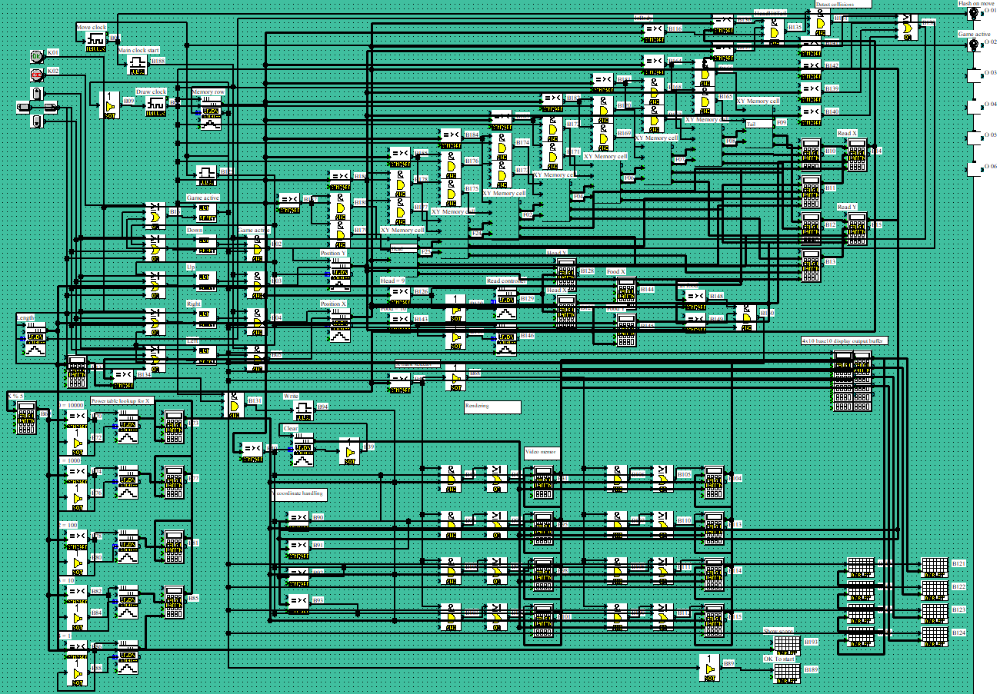
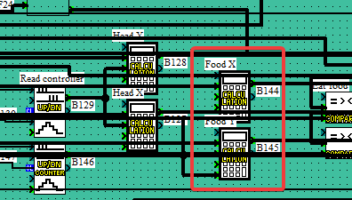
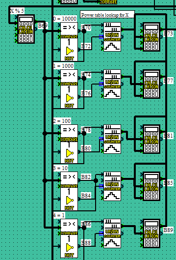
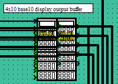
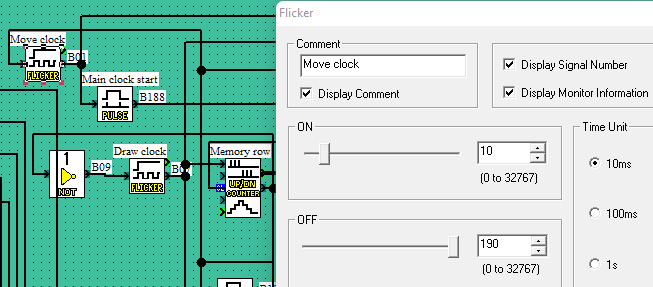

# ShiftySnake

https://user-images.githubusercontent.com/6792749/236620984-9d598371-2e43-4aca-9756-abc4851292f4.mp4

My previous attempt at making snake for the alpha was very much rooted in attempting to do things the way I would have done them in C by almost line for line replicating an arduino program. This however meant I had to deal with the memory limitations of the alpha, especially the severly limited display.

The main issue of the display is the 200 block limit. There are 2 ways to write to the display using the display block:

1. Write a fixed string, up to 4x12 characters long
2. Write a number, up to 5 digits long

Becasue the string is fixed its not very useful for making games, so we will ignore that. 5 digits however means we only need 8 display blocks for an 4x10 display, half what I used for the 4x4 display in arduSnake.

This gives us 4 realistic options for display:

* Integrated 4x12 display driven per pixel by 12 display blocks in base10
* Integrated 4x10 display driven per pixel by 8 display blocks in base10
* External display with up to 32 pixels per row in base2
* Integrated 8x10 display using stacked calculator monitoring output in a base10 graphcs memory. This however means you can only play in the simulator.

The only major difference between them code wise is how the pixels are updated. When using the integrated display we would use powers of 10 while with an external display we would use powers of 2 in our GPU.

The game itself will still operate on a simplified representation - directly updating and maintaining state of the game in the display buffers is very complicated and error prone due to its scanning nature.

## Game logic

The game stores the snakes position in 2 shifting array buffers built using calculator blocks, one for the X coordinate and one for the Y coordinate. Whether each block is rendered depends on an external length counter. Collisions is checked by comparing the head of the snake to the rest of the snake while scanning through for rendering.

The snake length is limited to 8 segments including head. It could potentially be extended to 9 segments by not overlapping the head and tail.

In addition, I hardcode the position of the head and food externally to the array buffer. To facilitate randomly moving food with a limited number of blocks available I use the following formulas:

Food X position = `( length % 8 * 2 ) * render_select`

Food Y position = `( length % 2 + 1 ) * render_select`

This gives a satisfactory "random" position for the food while only using 2 blocks, but is fairly limited in distribution and ends up making each food piece close to the last. This is probably the primary area for improvement.

## GPU logic

The GPU consists of 8 calculator memory cells. It is updated one cell at a time.

### Memory cell update

1. Clear the memory cell to 0
2. Loop through the snake array for each row we want to draw. `x = a | b`
3. Use a shortcut. Since we know that we will never get a double write to the same memory cell, we can add 2^x to the memory cell instead of doing a bitwise OR. This is because `x = a + 2^b` is the same as `x = a | (1 << b)`, which is the same as setting the xth bit to 1, as long as we know that the bit is not already set. We can use the same shortcut with an internal base 10 display as well.

The difficult part of this is the exponent. Alpha does not have an operator for this, so we have to roll out own. There are 2 ways:

1. Loop through bits multiplying by 2 each time
2. Use a lookup table

To maintain the framerate and reduce complexity I opted to use a lookup table. For a base2 approach I believe the loop would be the only feasible option.

The lookup function uses updowncounters to select calculator functions. The counter is incremented with a binary signal and reset with a falling edge of the write signal. This means the output is 1/0 corresponding to True/False.

The calculator runs `( 1000 * counter ) + D` where `D` is the result from the previous lookup function.

This means the last function can return 1, 10, 100, 1000 or 10000 depending on the input. This function is added to one of the 8 memory cells for each section of the snake.

### Code

We operate on 1 set of X,Y coordinates at a time. Using that we need to selectively update a single display memory cell.

Before loop:

1. Clear the memory cells to 0
  - 1 compare block, 1 counter, 1 not, 8x OR = 11 blocks

Loop:

1. Amount to add = 10 ^ (X % 5)
  - Exponents aren't possible, so we handle this by using a lookup table with 5 comparators, counters, NOT blocks and calculators = 20 blocks + 2 to combine them
2. Figure out X bank to write to: IF X < 5 THEN X bank = 1 ELSE X bank = 2
  - 1 AND per memory cell, 1 compare = 9 blocks
3. Figure out Y cell to write to: 4 compare blocks feeding into the same AND as step 2
4. Send write for a single cycle, feeding into same AND as step 2
  - 1 pulse block, 1 compare block = 2 blocks
5. Loop to draw next pixel

Renderer budget:

| Function                | Amount | Used |
| ----------------------- | ------ | ---- |
| Clear memory cells      | 11     | 11   |
| Calculate amount to add | 22     | 21   |
| Calculate X cell        | 9      | 10   |
| Calculate Y cell        | 4      | 4    |
| Send write              | 2      | 1    |
| Video memory            | 8      | 8    |
| Display buffer          | 8      | 9    |
| Display blocks          | 8      | 8    |
| Total                   | 72     | 72   |

### Video memory cells

Because the wiring is making it quite difficult to read the program, I have decided to document the wiring here.

The video memory is divided in 2 banks of 4 cells. Each cell stores 5 pixels.

Each cell consists of 3 blocks - AND, OR and a calculator.

- First input on the AND block is the bank select signal
- Second input on the AND block is the Y coordinate select signal
- Third input on the AND block is the write signal configured as `shift clock` falling trigger

The OR block is used to combine the cell level write with a block level write used to clear the entire memory before rendering (connected to input 2 on the OR block)

The calculator is used to store the current value of the cell. The output loops back to input A. The formula is `Y = (A+B)*C`, where:

- A is the current value of the cell
- B is the write value from the `10^X` section
- C is set to 0 to clear the cell

### Display output

On render step 11 we move the video memory to the output buffer. The output buffer is fed into the display blocks. This prevents the screen from flickering while doing the rendering.

## Performance

For an 4x10 display we need 20ms * 12 = 240ms for rendering and outputting to the display. The limiter is the number of pixel draw steps.

- 0 = Clear video memory
- 1-8 = Draw snake tail
- 9 = Draw snake head
- 10 = Draw food
- 11 = Copy video memory to output buffer

The clock is locafted in the top left corner of the program. There are 2 clocks

### Move clock

Sets the speed of the snake. By default I have set it ON for 100ms and OFF for 1900ms, giving us 0.5 FPS. It can be lowered if faster gameplay is desired.

### Render clock

Sets the speed of rendering the pixels. By default I have set it to 10/10ms to give us the fastest possible rendering speed. If the physical alpha has consistency issues it might help to increase it a bit. Running it high also allows you to visualize the rendering process better.

## Improvements

Currently the program is at the 200 block limit, but there are a few things I'd still like to improve:

1. [ ] Random food position - should be distributed better, could be done with an extra calculator or two
2. [x] Game over/instruction screen. Can probably be done with a display block or two hooked up to existing functionality

To implement anything else we need to save a few blocks somewhere.

The counters used to select values from calculators can in theory be done without a NOT block, but that makes the analog output only stay high for a single cycle. This is done by setting the `number of counts` to `1` and dragging the binary output to the CL pin. This can save:

- 8 blocks in the array buffer
- 5 blocks in the power lookup
- 1 block in the head render circuit
- 1 block in the food render circuit

The primary issue with 1 cycle counters is that the alpha is not deterministic - it will sometimes skip over stuff. This is best demonstrated by 2 counters - one driven by a 10ms flicker, and the other driven by the same 10ms flicker but through a `pulse` block set to `From On to Off And Off to On`. I have never ran it in hardware, but in the simulator the speed of the pulse counter depends on the hardware it is running on.

- On my R5 1600x it managed to outperform the straight flicker by 30%
- On my 12800HX it was half the speed of the straight flicker
- I have no idea how it translates to the alpha hardware
